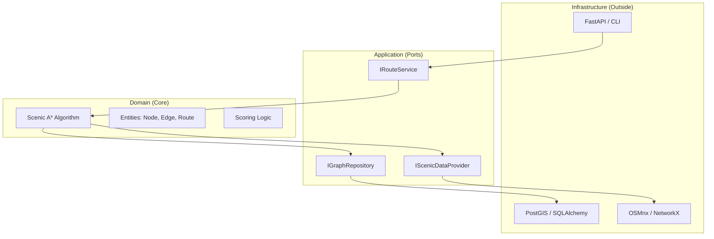

# 🌸 Yorimichi (寄り道) 
> **"The art of the scenic detour."** | **「寄り道の美学をデジタル化する。」**

**Yorimichi** is a high-performance routing engine designed to prioritize **experience over efficiency**. While traditional GPS focuses on the shortest path from A to B, Yorimichi calculates the most enriching journey through the historic Higashiyama district of Kyoto.

)

---

## 🗺️ Vision / ビジョン

In Japanese culture, **Yorimichi** means to stop by somewhere on one's way home or to take a side trip. This engine digitizes that spontaneity. 

日本における「寄り道」の文化をデジタル化します。最短距離ではなく、あえて遠回りをしてでも通りたい「情緒ある道」を提案します。

- **Focus Area:** Higashiyama, Kyoto (Temples, Shrines, Parks, and Traditional Alleys).
- **Core Value:** Discovery over speed. (スピードよりも、発見を。)

---

## 🛠️ Tech Stack / 技術スタック

| Component | Technology | Why? |
| :--- | :--- | :--- |
| **Language** | **Python 3.12+** | Generics and type hints for enterprise-quality, self-documenting code. |
| **Mapping** | **OSMnx / NetworkX** | Standard tooling for retrieving and processing real-world road networks. |
| **Web API** | **FastAPI** | Modern, asynchronous, automatic OpenAPI documentation. *(Added once the core engine is proven.)* |
| **Database** | **PostgreSQL + PostGIS** | The gold standard for geospatial data persistence at scale. *(Introduced as a second Infrastructure adapter: see Roadmap.)* |
| **ORM** | **SQLAlchemy 2.0** | Powerful, type-safe mapping from objects to SQL. |
| **Package Manager** | **Poetry** | Consistent, reproducible dependency management. |

**Dependency injection** is handled via plain constructor injection at the composition root — no DI framework. In a hexagonal architecture this small, an explicit factory function wiring concrete adapters into ports is clearer and easier to reason about than an additional library.

---

## 🧠 Algorithm: Scenic A* (S-A*) / アルゴリズム

The heart of Yorimichi is a modified A* search where the **scenic penalty is applied per edge**, not to the accumulated path cost, this keeps the cost function well-defined and lets the heuristic remain provably admissible:

$$\text{edgeCost}(u, v) = \text{distance}(u, v) \times \text{ScenicPenalty}(u, v) \times \text{RoadPenalty}(u, v)$$

$$g(n) = \sum \text{edgeCost along the path from start to } n$$

$$f(n) = g(n) + h(n)$$

- **$g(n)$**: Accumulated *scenic- and road-weighted* distance from start to the current node. (スタート地点からの、情緒・道路重み付き実距離)
- **$h(n)$**: Heuristic distance to destination: straight-line distance scaled by the **best-case (minimum) scenic multiplier**, so the heuristic never overestimates the true remaining cost. (目的地までのヒューリスティック距離)
- **$\text{ScenicPenalty}(u, v)$**: Factor based on proximity to nearby OSM points of interest (temples, shrines, parks), weighted by category: a temple/shrine pulls harder than a generic "attraction" tag.
    - **Factor < 1.0** (e.g., 0.6–0.9): Scenic edge (discount on cost).
- **$\text{RoadPenalty}(u, v)$**: Factor based on OSM's `highway` tag, penalizing car-heavy arterial roads.
    - **Factor > 1.0** (e.g., 1.25–1.6): Busy/unattractive edge (`primary`, `trunk`, `secondary`, and their `_link` variants).

> **Why per-edge, not per-path?** Applying the multiplier to the total accumulated distance (rather than each edge) can make the heuristic inadmissible. A* would no longer be guaranteed to find the actual lowest-cost scenic route, just *a* route. Scaling the heuristic by the best-case multiplier preserves A*'s optimality guarantee for the scenic cost space, and has been validated by parametrized admissibility tests plus deterministic route-divergence tests for both the scenic discount and the road penalty in isolation.

---

## ⚠️ Known Limitation: Scenic Tag Coverage

Scenic scoring currently relies on a **curated, hand-picked set of OSM tags** (e.g. `historic=temple`, `amenity=place_of_worship`, `leisure=park`). Real-world OpenStreetMap tagging is crowd-sourced and inconsistent, during development, genuine scenic points were initially missed because they were tagged as `historic=wayside_shrine` or `building=temple` rather than the more "obvious" tags first assumed. A `wikipedia`/`wikidata`-link fallback was added to catch some of these gaps, but **no finite hardcoded tag list can ever be fully complete.** This is tracked as a deliberate next step (Phase 2.5) rather than treated as solved.

---

## 🔭 Future Vision
Currently scoped to Higashiyama, Kyoto as a proof of concept. The architecture 
is designed to eventually scale to all of Kyoto, then Japan more broadly, and 
potentially other regions (e.g. Belgium), requiring PostGIS-backed persistence 
(Phase 5) and region-configurable scenic scoring profiles rather than hardcoded 
Japan-specific logic (e.g. religion=buddhist/shinto).

---

## 🏗️ Architecture / アーキテクチャ

This project follows a **Hexagonal Architecture (Ports & Adapters)** to ensure the business logic remains fully decoupled from external technologies like PostGIS, OSMnx, or FastAPI.

本プロジェクトは**ヘキサゴナルアーキテクチャ**を採用しており、ビジネスロジックを外部技術（PostGIS、FastAPIなど）から完全に分離しています。

1. **Domain (Core / ドメイン核):** Pure Python logic. No external dependencies. Contains the S-A* algorithm, entities, and scoring rules.
2. **Application (Ports / ポート):** Orchestrates the flow using abstract interfaces (Ports), depends only on the Domain and the port interfaces, never on concrete infrastructure.
3. **Infrastructure (Outside / 外部):** Real-world implementations (OSMnx graph loading, NetworkX traversal, later PostGIS persistence and a FastAPI entrypoint).

---

## 🚧 Roadmap / Status

Built incrementally, proving the core idea before adding infrastructure complexity:

- [x] **Phase 1: Core Algorithm:** S-A* implemented and tested against plain A* on an in-memory OSMnx/NetworkX graph of Higashiyama, with an admissible scoring heuristic (parametrized correctness tests).
- [x] **Phase 2: Real Scenic Scoring:**
    - [x] Proximity-based discount for scenic OSM POIs, weighted by category (temples/shrines > generic attractions)
    - [x] Penalty (>1.0 multiplier) for busy/unattractive road types (`primary`/`trunk`/`secondary`), validated against real Higashiyama routes and deterministic synthetic tests
- [ ] **Phase 2.5: Broaden scenic tag coverage:** Query OSM more broadly (any `amenity`/`historic`/`tourism`/`building` tag, not a fixed list) and filter/weight results afterward, rather than relying on a hand-curated tag list that risks missing real scenic points — see *Known Limitation* above.
- [ ] **Phase 3: Hexagonal Wiring:** Full Domain / Application / Infrastructure separation with the in-memory adapter as the first concrete `IGraphRepository`.
- [ ] **Phase 4: API Layer:** FastAPI adapter exposing a `/route` endpoint.
- [ ] **Phase 5: Persistence:** PostGIS-backed `IGraphRepository` adapter, swapped in without touching the Domain or Application layers — the real proof that the architecture holds.
- [ ] **Phase 6: Visualization:** Map output comparing the scenic route against the shortest route.

---

> “Yorimichi: Because the shortest path isn't always the best one.”
> 
> 「寄り道：最短ルートが、最高のルートとは限らない。」
