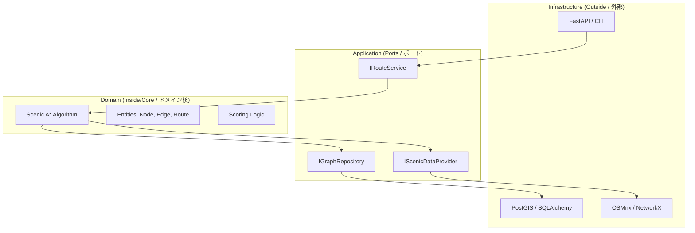

# 🌸 Yorimichi (寄り道) 
> **"The art of the scenic detour."** | **「寄り道の美学をデジタル化する。」**

**Yorimichi** is a high-performance routing engine designed to prioritize **experience over efficiency**. While traditional GPS focuses on the shortest path from A to B, Yorimichi calculates the most enriching journey through the historic Higashiyama district of Kyoto.

)

---

## 🗺️ Vision / ビジョン
In Japanese culture, **Yorimichi** means to stop by somewhere on one's way home or to take a side trip. This engine digitizes that spontaneity. 
日本の「寄り道」文化をデジタル化します。最短距離ではなく、あえて遠回りをしてでも通りたい「情緒ある道」を提案します。

- **Focus Area:** Higashiyama, Kyoto (Temples, Shrines, Parks, and Traditional Alleys).
- **Core Value:** Discovery over speed. (スピードよりも、発見を。)

---

## 🛠️ Tech Stack / 技術スタック
| Component | Technology | Why? |
| :--- | :--- | :--- |
| **Language** | **Python 3.12+** | Use of Generics and Type Hints for enterprise quality. |
| **Web API** | **FastAPI** | Modern, asynchronous, and automatic documentation. |
| **DI** | **Punq** | To plug adapters into ports at runtime. |
| **Database** | **PostgreSQL + PostGIS** | The gold standard for geospatial data persistence. |
| **ORM** | **SQLAlchemy 2.0** | Powerful mapping from objects to SQL. |
| **Mapping** | **OSMnx / NetworkX** | Processing complex road networks. |
| **Package Manager** | **Poetry** | Consistent and secure dependency management. |

---

## 🧠 Algorithm: Scenic A* (S-A*) / アルゴリズム
The heart of Yorimichi is a weighted cost function within the A* search space:

$$f(n) = g(n) \cdot ScenicPenalty(e) + h(n)$$

- **$g(n)$**: Actual distance from start to current node. (スタート地点からの実距離)
- **$h(n)$**: Heuristic distance to destination. (目的地までの直線距離)
- **$ScenicPenalty(e)$**: Factor calculated by the `ScoringLogic`.
    - **Factor < 1.0** (e.g., 0.7): Scenic path (discount on cost).
    - **Factor > 1.0** (e.g., 1.5): Unattractive/Busy path (penalty on cost).

---

## 🏗️ Architecture / アーキテクチャ
This project follows a **Hexagonal Architecture (Ports & Adapters)** to ensure the business logic remains decoupled from external technologies like PostGIS or FastAPI.
本プロジェクトは**ヘキサゴナルアーキテクチャ**を採用しており、ビジネスロジックを外部技術（PostGIS、FastAPIなど）から完全に分離しています。

1. Domain (Core): Pure Python logic. No dependencies. Contains the S-A* algorithm and scoring mathematical rules.
2. Application (Use Cases): Orchestrates the flow using abstract interfaces (Ports).
3. Infrastructure (Adapters): Real-world implementations (PostGIS queries, OSMnx scraping, NetworkX transformations).

> “Yorimichi: Because the shortest path isn't always the best one.”
> 
> 「寄り道：最短ルートが、最高のルートとは限らない。」
