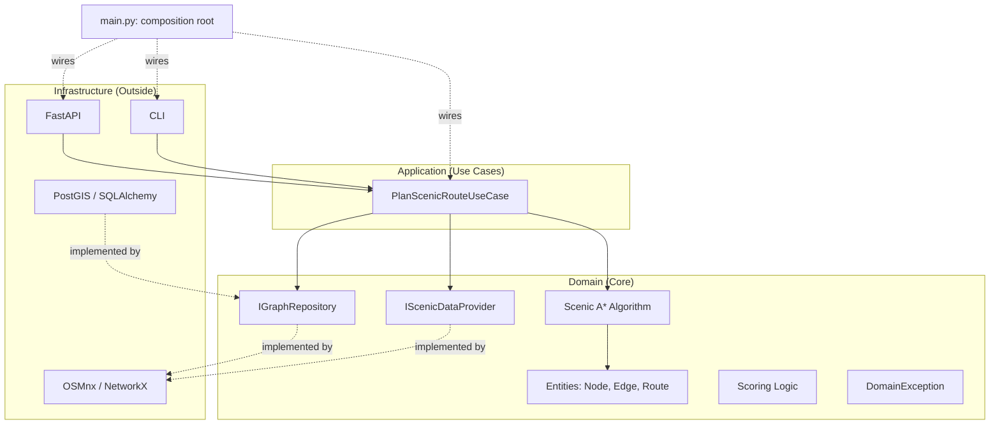

# 🌸 Yorimichi (寄り道) 
> **"The art of the scenic detour."** | **「寄り道の美学をデジタル化する。」**

**Yorimichi** is a high-performance routing engine designed to prioritize **experience over efficiency**. While traditional GPS focuses on the shortest path from A to B, Yorimichi calculates the most enriching journey through the historic Higashiyama district of Kyoto.

)

---

## 🗺️ Vision / ビジョン

In Japanese culture, **Yorimichi** means to stop by somewhere on one's way home or to take a side trip. This engine digitizes that spontaneity. 

日本における「寄り道」の文化をデジタル化します。最短距離ではなく、あえて遠回りをしてでも通りたい「情緒ある道」を提案します。

- **Focus Area:** Higashiyama, Kyoto (Temples, Shrines, Parks, and Traditional Alleys).
- **Core Value:** Discovery over speed. (スピードよりも、発見を。)

---

## 📁 Repository Structure

This is a monorepo containing both the routing engine and its client application:

yorimichi/

├── backend/     ← Python/FastAPI routing engine (Phases 1-6, detailed below)

└── frontend/    ← React/Vite web & mobile client (in progress)

The backend is a fully self-contained, independently testable service, the frontend is one of potentially several consumers of its `/route` API.

---

## 🛠️ Tech Stack / 技術スタック

**Backend**

| Component | Technology | Why? |
| :--- | :--- | :--- |
| **Language** | **Python 3.12+** | Generics and type hints for enterprise-quality, self-documenting code. |
| **Mapping** | **OSMnx / NetworkX** | Standard tooling for retrieving and processing real-world road networks. |
| **Web API** | **FastAPI** | Modern, asynchronous, automatic OpenAPI documentation. |
| **Database** | **PostgreSQL + PostGIS** | The gold standard for geospatial data persistence at scale. Implemented as a second `IGraphRepository` adapter (Phase 5), running locally via Docker. |
| **ORM** | **SQLAlchemy 2.0** | Powerful, type-safe mapping from objects to SQL. |
| **Package Manager** | **Poetry** | Consistent, reproducible dependency management. |
| **Cross-origin requests** | **FastAPI CORSMiddleware** | Allows the Vite dev server (different origin/port) to call the backend's `/route` endpoint directly from the browser. |

**Frontend** *(in progress)*

| Component | Technology | Why? |
| :--- | :--- | :--- |
| **Framework** | **React + Vite + TypeScript** | Fast dev experience; static typing catches data-shape mismatches (e.g. a renamed backend field) at compile time rather than silently producing `undefined` in the UI. |
| **Map** | **react-leaflet** | Interactive map rendering, consuming the backend's `/route` endpoint. |
| **PWA** | **vite-plugin-pwa** | Installable, offline-tolerant experience for mobile use while walking/cycling. |
| **Live location** | **Browser Geolocation API** | Real-time position tracking during an active route, no extra dependency needed. |
| **Accessibility** | Custom CSS, color-blind-safe palette | Blue/orange route colors plus line-style differentiation (dashed/solid) instead of color alone. |

**Dependency injection** is handled via plain constructor injection at the composition root: no DI framework. In a hexagonal architecture this small, an explicit factory function wiring concrete adapters into ports is clearer and easier to reason about than an additional library.

---

## 🧠 Algorithm: Scenic A* (S-A*) / アルゴリズム

The heart of Yorimichi is a modified A* search where the **scenic penalty is applied per edge**, not to the accumulated path cost, this keeps the cost function well-defined and lets the heuristic remain provably admissible:

$$\text{edgeCost}(u, v) = \text{distance}(u, v) \times \text{ScenicPenalty}(u, v) \times \text{RoadPenalty}(u, v)$$

$$g(n) = \sum \text{edgeCost along the path from start to } n$$

$$f(n) = g(n) + h(n)$$

- **$g(n)$**: Accumulated *scenic- and road-weighted* distance from start to the current node. (スタート地点からの、情緒・道路重み付き実距離)
- **$h(n)$**: Heuristic distance to destination: straight-line distance scaled by the **best-case (minimum) scenic multiplier**, so the heuristic never overestimates the true remaining cost. (目的地までのヒューリスティック距離)
- **$\text{ScenicPenalty}(u, v)$**: Factor based on proximity to nearby OSM points of interest (temples, shrines, parks), weighted by category: a temple/shrine pulls harder than a generic "attraction" tag.
    - **Factor < 1.0** (e.g., 0.6–0.9): Scenic edge (discount on cost).
- **$\text{RoadPenalty}(u, v)$**: Factor based on OSM's `highway` tag, penalizing car-heavy arterial roads.
    - **Factor > 1.0** (e.g., 1.25–1.6): Busy/unattractive edge (`primary`, `trunk`, `secondary`, and their `_link` variants).

> **Why per-edge, not per-path?** Applying the multiplier to the total accumulated distance (rather than each edge) can make the heuristic inadmissible. A* would no longer be guaranteed to find the actual lowest-cost scenic route, just *a* route. Scaling the heuristic by the best-case multiplier preserves A*'s optimality guarantee for the scenic cost space, and has been validated by parametrized admissibility tests plus deterministic route-divergence tests for both the scenic discount and the road penalty in isolation.

---

## ⚠️ Known Limitation: Scenic Tag Coverage

Scenic scoring initially relied on a **curated, hand-picked set of OSM tags** (e.g. `historic=temple`, `amenity=place_of_worship`, `leisure=park`). Real-world OpenStreetMap tagging is crowd-sourced and inconsistent, during development, genuine scenic points were initially missed because they were tagged as `historic=wayside_shrine` or `building=temple` rather than the more "obvious" tags first assumed.

To address this (Phase 2.5), `historic` is now queried **broadly** (`historic=True`, all values) rather than a fixed list, with filtering and category-weighting happening afterward, validated against real Higashiyama data (603 → 1206 scenic points found once broadened). This also surfaced a genuine, unanticipated finding: `historic=memorial` turned out to be the single most common tag in this district (363 occurrences), likely reflecting small religious/cultural markers tied to nearby temple and shrine grounds specific to this cultural context. This is a concrete, early signal that scenic scoring will need **region-configurable weighting profiles** at larger scale (see *Future Vision*) rather than a single hardcoded weight table, a "memorial" carries different scenic connotations in Japan than it might in, say, Belgium.

A `wikipedia`/`wikidata`-link fallback also catches some category gaps regardless of region, but **no tagging strategy can ever be considered fully complete**, this remains an area for ongoing refinement rather than a solved problem.

---

## 🔭 Future Vision
Currently scoped to Higashiyama, Kyoto as a proof of concept. The architecture 
is designed to eventually scale to all of Kyoto, then Japan more broadly, and 
potentially other regions (e.g. Belgium), requiring PostGIS-backed persistence 
(Phase 5) and region-configurable scenic scoring profiles rather than hardcoded 
Japan-specific logic (e.g. religion=buddhist/shinto, or category weights tuned 
for one cultural context: see *Known Limitation* above for a concrete example 
of this surfacing already during Higashiyama-only development).

Longer-term, the goal is a Google Maps-like experience at a much smaller, more 
curated and customizable scale: prioritizing discovery and aesthetics over 
comprehensive global coverage, with a distinctly personal, illustrated map style 
rather than a generic default look.

---

## 🏗️ Architecture / アーキテクチャ

This project follows a **Hexagonal Architecture (Ports & Adapters)** to ensure the business logic remains fully decoupled from external technologies like OSMnx, NetworkX, PostGIS, or FastAPI.

本プロジェクトは**ヘキサゴナルアーキテクチャ**を採用しており、ビジネスロジックを外部技術（OSMnx、PostGIS、FastAPIなど）から完全に分離しています。

1. **Domain (Core / ドメイン核):** Pure Python logic with zero external dependencies. Contains entities (`Node`, `Edge`, `Route`), scoring rules, the S-A* algorithm, and the repository ports themselves (`IGraphRepository`, `IScenicDataProvider`): the Domain dictates the contract for what data it needs, not the infrastructure providing it.
2. **Application (Use Cases):** Orchestrates the flow using only Domain entities and ports: `PlanScenicRouteUseCase` never imports NetworkX or any concrete infrastructure, and never returns raw infrastructure objects (e.g. a NetworkX graph) to its callers.
3. **Infrastructure (Outside / 外部):** Real-world implementations: OSMnx graph loading and NetworkX pathfinding execution (`OSMnxGraphRepository`), a second, fully interchangeable `IGraphRepository` implementation backed by PostGIS (`PostGISGraphRepository`) using a real spatial query (`ST_Distance`) for nearest-node lookups: scenic POI fetching and KD-tree lookup (`OSMnxScenicDataProvider`), the NetworkX-to-Domain-entity translation layer (`osmnx_routing_adapter`), and a FastAPI entrypoint (`fastapi_app.py`) exposing the same Use Case over HTTP.
   

---

## 🚧 Roadmap / Status

Built incrementally, proving the core idea before adding infrastructure complexity:

- [x] **Phase 1: Core Algorithm:** S-A* implemented and tested against plain A* on an in-memory OSMnx/NetworkX graph of Higashiyama, with an admissible scoring heuristic (parametrized correctness tests).
- [x] **Phase 2: Real Scenic Scoring:**
    - [x] Proximity-based discount for scenic OSM POIs, weighted by category (temples/shrines > generic attractions)
    - [x] Penalty (>1.0 multiplier) for busy/unattractive road types (`primary`/`trunk`/`secondary`), validated against real Higashiyama routes and deterministic synthetic tests
- [x] **Phase 2.5: Broaden scenic tag coverage:** Queried OSM more broadly (`historic=True` instead of a fixed list), filtered/weighted afterward. Validated on Higashiyama: 603 → 1206 scenic points found. Surfaced a concrete, region-specific scoring nuance (`historic=memorial` unexpectedly dominant here): see *Known Limitation*.
- [x] **Phase 3: Hexagonal Wiring:** Full Domain / Application / Infrastructure separation. Domain (`entities.py`, `scoring.py`, `routing.py`, `repositories.py`, `exceptions.py`) has zero external dependencies: verified via a "zero mocks" litmus test and a self-contained Haversine implementation replacing `osmnx.distance.great_circle`. Domain-owned repository ports (`IGraphRepository`, `IScenicDataProvider`) use a functional contract (e.g. `get_scenic_penalty(lat, lon)`) rather than exposing infrastructure-specific data structures (KD-trees, NetworkX graphs). `PlanScenicRouteUseCase` orchestrates purely through these ports and Domain entities (`Node`, `Edge`, `Route`): it never imports NetworkX or returns raw infrastructure objects. Three concrete Infrastructure adapters (`OSMnxGraphRepository`, `OSMnxScenicDataProvider`, `osmnx_routing_adapter`) implement these ports, with per-place caching to avoid redundant re-fetching. Verified end-to-end: identical route output before and after the full refactor.
- [x] **Phase 4: API Layer:** FastAPI adapter exposing a `/route` endpoint, backed by `PlanScenicRouteUseCase`. Dependency wiring lives exclusively in the composition root (`main.py`) via FastAPI's `Depends`: the API adapter itself never instantiates concrete Infrastructure classes. A `DomainException` base class (with `CoordinatesOutOfRangeException` as its first concrete case) lets a single global exception handler translate any business-rule violation into a `400 Bad Request`, while genuinely unexpected errors still surface as `500`. Pydantic DTOs (`RouteDTO`, `RouteResponse`) give the endpoint an explicit, auto-documented schema: Domain's `Route` entity never leaks into the HTTP layer directly. Caught and fixed a real edge case during manual testing: coordinates far outside Higashiyama (e.g. `(0, 0)`) previously returned a silently nonsensical route instead of an error. 40+ tests across `unit/domain/`, `unit/application/`, and `unit/infrastructure/` (including FastAPI's `TestClient` for endpoint-level tests), plus a dedicated `integration/` suite validating scenic scoring against real, live OSM data for Higashiyama.
- [x] **Phase 5: Persistence:** PostGIS-backed `IGraphRepository` adapter (`PostGISGraphRepository`), swapped into `PlanScenicRouteUseCase`. Graph data is pre-imported once from OSMnx into PostGIS tables (`yorimichi_nodes`, `yorimichi_edges`, via `scripts/import_graph_to_postgis.py`) and loaded into an in-memory NetworkX graph on demand, reusing the existing pathfinding logic unchanged. `nearest_node()` uses a genuine PostGIS spatial query (`ST_Distance` against a GiST-indexed geometry column) rather than a Python-side KD-tree: the one place this adapter meaningfully leverages PostGIS's spatial capabilities beyond plain storage. The graph backend (OSMnx vs. PostGIS) is selectable via the `YORIMICHI_GRAPH_BACKEND` environment variable in the composition root (`main.py`), itself a live demonstration of the architecture's swappability. Verified end-to-end: identical route output (`1446.9m` / `1575.5m` for the Kiyomizu-dera → Yasaka Shrine pair) across both backends, both manually and via automated cross-backend integration tests. Database credentials are loaded via `.env`/environment variables, never hardcoded. 52 tests total across `unit/` and `integration/`, all passing.
- [ ] **Phase 6: Client Application:** A React/Vite frontend (in `frontend/`) consuming the backend's `/route` API evolving beyond the original "static map output" scope into a full walking/cycling companion app:
    - [x] Interactive map (react-leaflet) rendering live baseline and scenic routes fetched from `/route`, with real coordinates (backend's `RouteDTO` extended to include an ordered list of `(lat, lon)` pairs alongside `node_ids`, so the frontend never needs to resolve node IDs to coordinates itself). CORS configured on the FastAPI app to allow the Vite dev server origin.
    - [x] Manual start/destination selection via map clicks
    - [x] GPS-based start point (via browser Geolocation API)
    - [x] Filterable/boostable scenic categories (⛩️ shrines & temples, 🌸 parks, 🌊 waterside, 🏯 historic sites, 🌳 nature, 🌉 viewpoints), passed as parameters to `/route`. Implemented as a **multiplicative boost model**, not binary filtering: an inactive category remains at neutral strength (still contributes) rather than being silenced entirely. This was a deliberate correction after discovering that pure on/off filtering had no measurable effect on route selection in Higashiyama, where `shrines_temples` is overwhelmingly dominant, muting other categories wasn't enough to shift A*'s choice, since the strongest signal remained untouched. Boost strength is configurable per request (`boost_categories` for a default 1.5× multiplier, or explicit `category:multiplier` pairs via `category_boosts`), validated end-to-end with real, dramatic route divergence. Category weighting was further refined using an empirical tag-frequency analysis of the full Kansai region `.osm.pbf` extract (8M+ tagged elements): added `natural=tree` (51k+ occurrences, previously missing entirely), `landuse=forest`, `natural=tree_row`, and two thematic signals specific to this project — `genus=Cerasus` (cherry blossom trees) and `ceremonial_gate=torii`, both scored at maximum weight.
    - [x] Accessible route visualization: color-blind-safe blue/orange palette (replacing an initial red/green scheme) plus a redundant visual signal (dashed baseline vs. solid scenic line), so routes remain distinguishable independent of color perception.
    - [x] Migrated to TypeScript for stronger data-contract guarantees between frontend and backend (shared `RouteResponse`/`RouteDTO`/`Coordinate` types mirroring the backend's Pydantic models), plus a responsive, collapsible control panel that adapts its default state to viewport width, addressing the practical constraint that a permanently-expanded desktop-style panel would obscure most of the map on a phone screen during actual on-foot use.
    - [ ] Walking vs. cycling mode (requires a backend extension: `network_type` parameter on graph fetching, currently hardcoded to `"walk"`)
    - [ ] PWA installability and offline tolerance for mobile use
    - [ ] Live route tracking via the Geolocation API while walking
    - [ ] Street-level imagery integration (Mapillary, free/open: Google Street View considered but requires a paid API)

---

> “Yorimichi: Because the shortest path isn't always the best one.”
> 
> 「寄り道：最短ルートが、最高のルートとは限らない。」